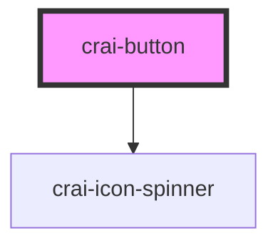

# crai-button

Button element based on the `<button>` element.
[MDN Reference](https://developer.mozilla.org/en-US/docs/Web/HTML/Reference/Elements/button)

<!-- Auto Generated Below -->

## Properties

| Property   | Attribute  | Description    | Type                              | Default     |
| ---------- | ---------- | -------------- | --------------------------------- | ----------- |
| `disabled` | `disabled` |                | `boolean`                         | `false`     |
| `icon`     | `icon`     |                | `boolean`                         | `false`     |
| `loading`  | `loading`  |                | `boolean`                         | `false`     |
| `type`     | `type`     | Button type    | `"button" \| "reset" \| "submit"` | `'button'`  |
| `variant`  | `variant`  | Button variant | `"glass" \| "primary"`            | `'primary'` |

## Events

| Event         | Description | Type                      |
| ------------- | ----------- | ------------------------- |
| `craiClicked` |             | `CustomEvent<MouseEvent>` |

## Dependencies

### Depends on

- [crai-icon-spinner](../icons/crai-icon-spinner)

### Graph

----------------------------------------------

*Built with [StencilJS](https://stenciljs.com/)*
