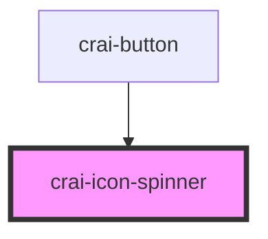

# crai-icon-spinner

<!-- Auto Generated Below -->

## Properties

| Property | Attribute | Description | Type               | Default                                  |
| -------- | --------- | ----------- | ------------------ | ---------------------------------------- |
| `color`  | `color`   |             | `string`           | `'var(--crai-icon-color, currentColor)'` |
| `size`   | `size`    |             | `number \| string` | `'1.2rem'`                               |

## Dependencies

### Used by

 - [crai-button](../../crai-button)

### Graph

----------------------------------------------

*Built with [StencilJS](https://stenciljs.com/)*
